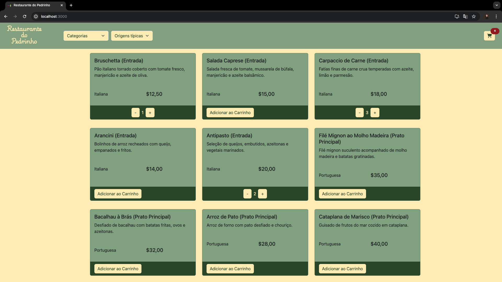

# Restaurante do Pedrinho

## Passos Iniciais

### Clonar o repositório

```bash
git clone https://github.com/pedroHenriqueMaia/restaurante-react-redux.git
cd restaurante-do-pedrinho
```

### Instalar Dependências

Certifique-se de ter o Node.js (versão 16.0 ou superior) instalado na sua máquina. Depois, execute:

```bash
npm install
```

## Comandos Principais

### Iniciar o projeto

```bash
npm start
```

Inicia o servidor de desenvolvimento. Abra [http://localhost:3000](http://localhost:3000) no seu navegador para ver o projeto rodando.

### Testes

```bash
npm test
```

Executa os testes unitários utilizando Jest.

### Formatar Código

```bash
npm run format
```

Formata o código utilizando Prettier.

### Lint

```bash
npm run lint
```

Executa o ESLint para verificar problemas no código.

```bash
npm run lint:fix
```

Executa o ESLint e corrija automaticamente problemas no código quando possível.

### Construir para Produção

```bash
npm run build
```

Compila o projeto para produção na pasta `build`.

## Configurações Adicionais

### Pré-hooks do Git

Este projeto possui um hook pré-commit configurado para executar o ESLint automaticamente antes de cada commit, garantindo que o código esteja formatado corretamente e não contenha problemas de lint. Você pode ver o script do hook pré-commit [aqui](.git/hooks/pre-commit).

## Tecnologias Utilizadas

Este projeto utiliza apenas Bootstrap e CSS para o design.

- React
- Redux
- ESLint e Prettier para formatação e linting
- Jest para testes unitários

## Hospedagem

Este projeto está hospedado na Netlify.

## Link de Produção

Acesse o projeto em produção através do link: [Restaurante do Pedrinho](https://master--restaurante-do-pedrinho.netlify.app/)

## Prints das Telas




